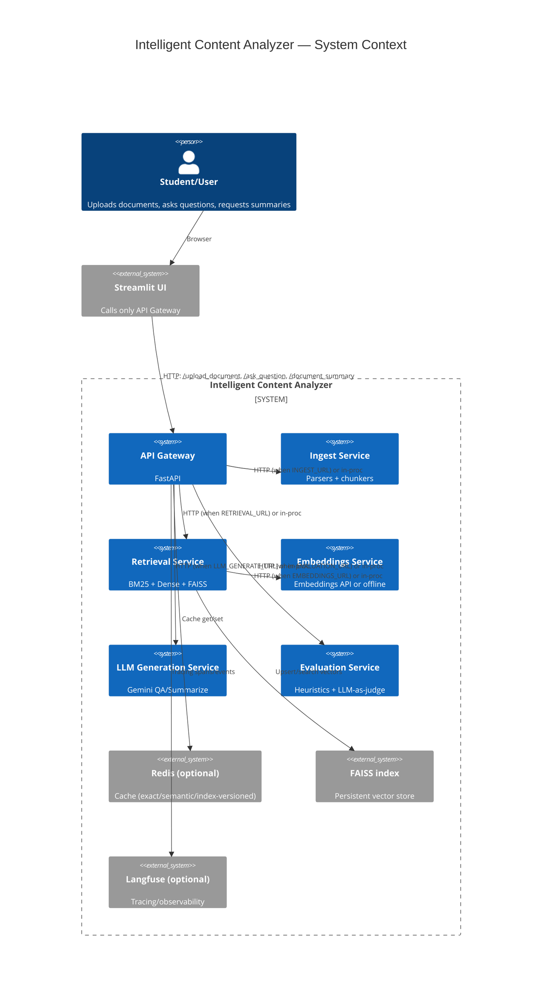
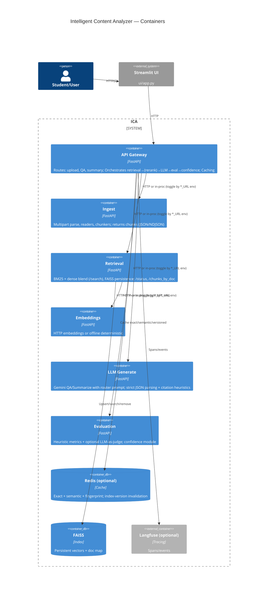
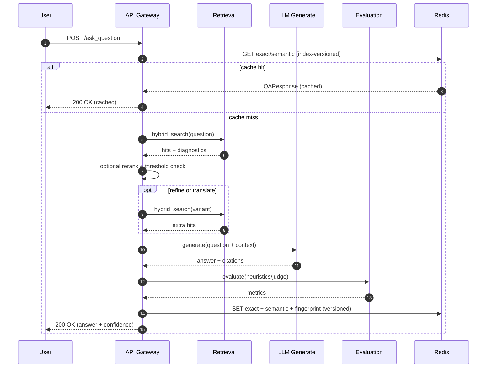

# Intelligent Content Analyzer — Architecture

This document explains the system architecture, data flow, and how the repository maps to the running services. It uses a C4 model to move from a high-level overview to detailed components.

- Source of truth for app wiring:
  - API Gateway: [services/api_gateway/app/main.py](services/api_gateway/app/main.py)
  - Routers:
    - Upload: [`services.api_gateway.app.routers.upload`](services/api_gateway/app/routers/upload.py)
    - QA: [`services.api_gateway.app.routers.qa`](services/api_gateway/app/routers/qa.py)
    - Summary: [`services.api_gateway.app.routers.summary`](services/api_gateway/app/routers/summary.py)
  - Retrieval: [services/retrieval/app/main.py](services/retrieval/app/main.py), hybrid: [services/retrieval/app/hybrid.py](services/retrieval/app/hybrid.py), FAISS: [services/retrieval/app/faiss_store.py](services/retrieval/app/faiss_store.py), reranker: [services/retrieval/app/rerank.py](services/retrieval/app/rerank.py)
  - Ingestion: [services/ingest/app/main.py](services/ingest/app/main.py), readers: [services/ingest/app/readers.py](services/ingest/app/readers.py), chunkers: [services/ingest/app/chunkers.py](services/ingest/app/chunkers.py)
  - LLM Generation: [services/llm_generate/app/main.py](services/llm_generate/app/main.py), prompts: [services/llm_generate/app/prompts.py](services/llm_generate/app/prompts.py)
  - Embeddings: [services/embeddings/app/main.py](services/embeddings/app/main.py), helpers: [services/embeddings/app/embeddings.py](services/embeddings/app/embeddings.py)
  - Evaluation: [services/evaluation/app/main.py](services/evaluation/app/main.py), confidence: [services/evaluation/app/confidence.py](services/evaluation/app/confidence.py), metrics: [services/evaluation/app/metrics.py](services/evaluation/app/metrics.py)
  - Shared libs: Models [shared/models.py](shared/models.py), Cache [shared/cache.py](shared/cache.py), Settings [shared/settings.py](shared/settings.py), Tracing [shared/tracing.py](shared/tracing.py)
  - Orchestration: [infra/docker-compose.yml](infra/docker-compose.yml), env: [.env.example](.env.example)
  - UI: [ui/app.py](ui/app.py)

Notes
- Dual run modes:
  - Local single-process: API Gateway imports other services in-proc (no servers).
  - HTTP microservices: When upstream URLs are set, API Gateway calls services over HTTP:
    - INGEST_URL, RETRIEVAL_URL, LLM_GENERATE_URL, EVALUATION_URL
- Retrieval exposes status/debug endpoints used in ops: [`/status`](services/retrieval/app/main.py), [`/chunks_by_doc`](services/retrieval/app/main.py), [`/debug/storage`](services/retrieval/app/main.py).

## Repository structure

- services/
  - api_gateway/ … FastAPI, routes, orchestration (HTTP or in-proc via toggles)
  - ingest/ … file parsing and chunking
  - retrieval/ … BM25 + dense hybrid, FAISS, reranker
  - embeddings/ … CPU-friendly embeddings abstraction (offline deterministic supported)
  - llm_generate/ … Gemini-based answer/summarize, router prompt, strict JSON parsing + citation heuristics
  - evaluation/ … heuristic metrics + optional LLM-as-judge, confidence blending
- shared/ … models, settings, cache, tracing
- infra/ … docker-compose and environment
- documentation/ … this documentation
- tests/ … unit tests
- ui/ … Streamlit client calling only the API Gateway

## C4 — Level 1: System context

## C4 — Level 2: Containers

## C4 — Level 3: Components (API Gateway)

```mermaid
%%{init: {"themeVariables": {"fontSize": "20px"}, "flowchart": {"htmlLabels": true}}}%%
flowchart TB
  subgraph API_Gateway["API Gateway (services/api_gateway/app)"]
    upload["Upload Router (/upload_document) — [`upload.py`](services/api_gateway/app/routers/upload.py)"]
    qa["QA Router (/ask_question) — [`qa.py`](services/api_gateway/app/routers/qa.py)"]
    summary["Summary Router (/document_summary) — [`summary.py`](services/api_gateway/app/routers/summary.py)"]
    cache_client["Cache Client — [`shared/cache.py`](shared/cache.py)"]
    tracing["Tracing — [`shared/tracing.py`](shared/tracing.py)"]
    settings["Settings — [`shared/settings.py`](shared/settings.py)"]
    models["Models — [`shared/models.py`](shared/models.py)"]
  end

  Retrieval["Retrieval Service — [`services/retrieval/app`](services/retrieval/app/main.py)"]
  LLM_Generate["LLM Generate — [`services/llm_generate/app`](services/llm_generate/app/main.py)"]
  Evaluation["Evaluation — [`services/evaluation/app`](services/evaluation/app/main.py)"]
  Embeddings["Embeddings — [`services/embeddings/app`](services/embeddings/app/main.py)"]
  FAISS[("FAISS Index + Doc Map — [`faiss_store.py`](services/retrieval/app/faiss_store.py)")]
  Cache[("Redis Cache (optional) — [`shared/cache.py`](shared/cache.py)")]
  Langfuse["Langfuse (optional) — [`shared/tracing.py`](shared/tracing.py)"]

  %% Internal relationships
  qa --> cache_client
  qa --> tracing
  upload --> tracing
  summary --> tracing

  %% API Gateway to services
  upload --> Retrieval
  qa --> Retrieval
  qa --> LLM_Generate
  qa --> Evaluation
  summary --> Retrieval
  summary --> LLM_Generate

  %% Retrieval dependencies
  Retrieval --> Embeddings
  Retrieval --> FAISS

  %% Cache usage
  qa <---> Cache
  summary <---> Cache
  upload --> Cache

  %% Observability
  qa -. spans/events .-> Langfuse
  Retrieval -. spans/events .-> Langfuse
  LLM_Generate -. spans/events .-> Langfuse
  Evaluation -. spans/events .-> Langfuse
```

## Updated data flow diagrams

### End-to-end flow (upload, ask, summarize)

### Sequence (QA happy path)

## Key design points

- Hybrid retrieval with optional RRF union and reranker:
  - [`services.retrieval.app.hybrid`](services/retrieval/app/hybrid.py), [`services.retrieval.app.rerank`](services/retrieval/app/rerank.py)
- FAISS persistence + doc map; status/ops:
  - [`services.retrieval.app.faiss_store`](services/retrieval/app/faiss_store.py), [`/status`](services/retrieval/app/main.py), [`/debug/storage`](services/retrieval/app/main.py), [`/chunks_by_doc`](services/retrieval/app/main.py)
- Caching: exact + semantic + fingerprint; index-version invalidation on upload:
  - [`shared.cache`](shared/cache.py), used in [`services.api_gateway.app.routers.qa`](services/api_gateway/app/routers/qa.py) and [`services.api_gateway.app.routers.summary`](services/api_gateway/app/routers/summary.py); version bump in [`services.api_gateway.app.routers.upload`](services/api_gateway/app/routers/upload.py)
- LLM generation: router prompt, strict JSON parsing, citation heuristics:
  - [`services.llm_generate.app.main`](services/llm_generate/app/main.py), prompts in [`services.llm_generate.app.prompts`](services/llm_generate/app/prompts.py)
- Evaluation and confidence:
  - [`services.evaluation.app.metrics`](services/evaluation/app/metrics.py), [`services.evaluation.app.main`](services/evaluation/app/main.py), [`services.evaluation.app.confidence`](services/evaluation/app/confidence.py)
- Tracing/observability (opt-in):
  - [`shared.tracing`](shared/tracing.py) wired in services and routers
- Render/cloud specifics:
  - Retrieval requires persistent disk at /app/data for FAISS/doc_map; ensure EMBEDDING_DIM matches across services.
  - Gateway summary path requires both RETRIEVAL_URL and LLM_GENERATE_URL; otherwise local mode is used.