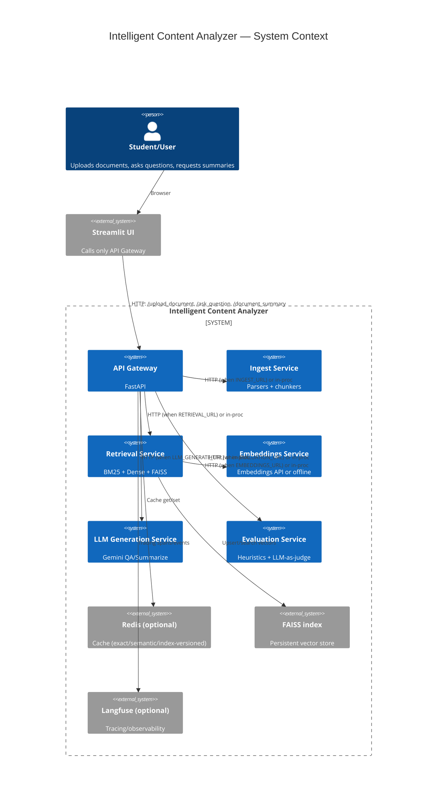
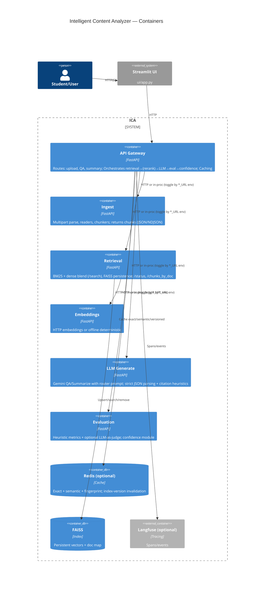
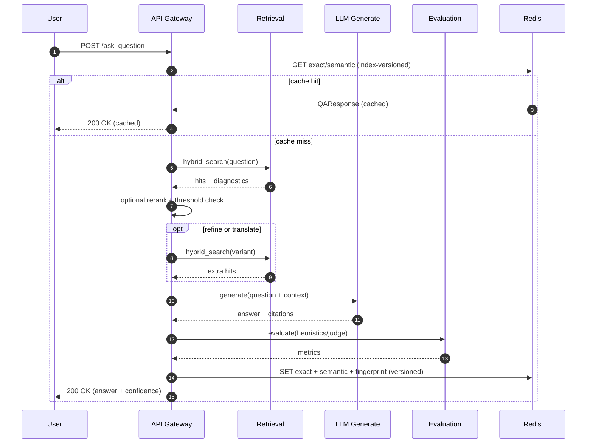

# Intelligent Content Analyzer 

A mini project that analyzes educational documents and provides intelligent insights to help students understand complex topics. It supports multilingual content and answers in the same language as the query.

- **Live API**: https://adredes-weslee-intelligent-content-analyzer-uiapp-stwg9a.streamlit.app/
- **OpenAPI docs**: /docs on the API Gateway: https://api-gateway-zzhe.onrender.com/docs

- **Source of truth for app wiring**:
  - **API Gateway**: [services/api_gateway/app/main.py](services/api_gateway/app/main.py)
  - **Routers**:
    - Upload: [`services.api_gateway.app.routers.upload`](services/api_gateway/app/routers/upload.py)
    - QA: [`services.api_gateway.app.routers.qa`](services/api_gateway/app/routers/qa.py)
    - Summary: [`services.api_gateway.app.routers.summary`](services/api_gateway/app/routers/summary.py)
  - **Retrieval**: [services/retrieval/app/main.py](services/retrieval/app/main.py), hybrid: [services/retrieval/app/hybrid.py](services/retrieval/app/hybrid.py), FAISS: [services/retrieval/app/faiss_store.py](services/retrieval/app/faiss_store.py), reranker: [services/retrieval/app/rerank.py](services/retrieval/app/rerank.py)
  - **Ingestion**: [services/ingest/app/main.py](services/ingest/app/main.py), readers: [services/ingest/app/readers.py](services/ingest/app/readers.py), chunkers: [services/ingest/app/chunkers.py](services/ingest/app/chunkers.py)
  - **LLM Generation**: [services/llm_generate/app/main.py](services/llm_generate/app/main.py), prompts: [services/llm_generate/app/prompts.py](services/llm_generate/app/prompts.py)
  - **Embeddings**: [services/embeddings/app/main.py](services/embeddings/app/main.py), helpers: [services/embeddings/app/embeddings.py](services/embeddings/app/embeddings.py)
  - **Evaluation**: [services/evaluation/app/main.py](services/evaluation/app/main.py), confidence: [services/evaluation/app/confidence.py](services/evaluation/app/confidence.py), metrics: [services/evaluation/app/metrics.py](services/evaluation/app/metrics.py)
  - **Shared libraries**: Models [shared/models.py](shared/models.py), Cache [shared/cache.py](shared/cache.py), Settings [shared/settings.py](shared/settings.py), Tracing [shared/tracing.py](shared/tracing.py)
  - **Orchestration**: [infra/docker-compose.yml](infra/docker-compose.yml), env: [.env.example](.env.example)
  - **UI**: [ui/app.py](ui/app.py)

**Notes**

- **Dual run modes**:
  - Local single-process: API Gateway imports other services in-proc (no servers).
  - HTTP microservices: When upstream URLs are set, API Gateway calls services over HTTP:
    - INGEST_URL, RETRIEVAL_URL, LLM_GENERATE_URL, EVALUATION_URL
- Retrieval exposes status/debug endpoints used in ops: [`/status`](services/retrieval/app/main.py), [`/chunks_by_doc`](services/retrieval/app/main.py), [`/debug/storage`](services/retrieval/app/main.py).

**Sample data**

- **Location**: [data/documents/](data/documents/)
  - [merge_sort.md](data/documents/merge_sort.md)
  - [MIT OCW - 6.006 Introduction to Algorithms Lecture Notes.pdf](data/documents/MIT%20OCW%20-%206.006%20Introduction%20to%20Algorithms%20Lecture%20Notes.pdf)
  - [README.ko-KR.md (Korean)](data/documents/README.ko-KR.md)
- **Multilingual support**: The system uses multilingual-friendly embeddings and LLMs. Queries can be asked in multiple languages, and answers are returned in the same language as the query whenever possible. Performance is better if the query is in the same language as the information from the source documents.

## Repository structure

```
intelligent-content-analyzer/
├─ services/
│  ├─ api_gateway/
│  │  ├─ app/
│  │  │  ├─ main.py
│  │  │  └─ routers/
│  │  │     ├─ upload.py
│  │  │     ├─ qa.py
│  │  │     ├─ summary.py
│  │  │     └─ debug.py          # debug router (GET /debug/upstreams)
│  │  └─ Dockerfile
│  ├─ ingest/
│  │  ├─ app/                    # main.py, readers.py, chunkers.py
│  │  └─ Dockerfile
│  ├─ retrieval/
│  │  ├─ app/                    # main.py, hybrid.py, faiss_store.py, rerank.py
│  │  └─ Dockerfile
│  ├─ embeddings/
│  │  ├─ app/                    # main.py, embeddings.py
│  │  └─ Dockerfile
│  ├─ llm_generate/
│  │  ├─ app/                    # main.py, prompts.py
│  │  └─ Dockerfile
│  └─ evaluation/
│     ├─ app/                    # main.py, metrics.py, confidence.py
│     └─ Dockerfile
├─ shared/
│  ├─ settings.py
│  ├─ models.py
│  ├─ cache.py
│  └─ tracing.py
├─ ui/
│  ├─ app.py
│  └─ requirements.txt          # for streamlit frontend
├─ data/
│  └─ documents/
│     ├─ merge_sort.md
│     ├─ MIT OCW - 6.006 Introduction to Algorithms Lecture Notes.pdf
│     └─ README.ko-KR.md         # Korean sample (multilingual supported; answers follow query language)
├─ tests/
│  ├─ conftest.py                # sets OFFLINE_MODE, EVAL_LLM_ENABLED, EMBEDDING_DIM, FAISS paths
│  ├─ test_api_gateway.py
│  ├─ test_chunkers.py
│  ├─ test_embeddings.py
│  ├─ test_evaluation.py
│  ├─ test_ingest.py
│  ├─ test_llm_generate.py
│  ├─ test_readers.py
│  └─ test_retrieval.py
├─ infra/
│  ├─ docker-compose.yml
│  └─ environment.yaml           # conda environment file
├─ requirements.txt              # for docker builds
├─ render.yaml                   
└─ README.md
```

## Architecture (C4)

### System context (L1)



### Containers (L2)



### Components (API Gateway, L3)

```mermaid
%%{init: {"themeVariables": {"fontSize": "20px"}, "flowchart": {"htmlLabels": true}}}%%
flowchart TB
  subgraph API_Gateway["API Gateway (services/api_gateway/app)"]
    upload["Upload Router (/upload_document) — [`upload.py`](services/api_gateway/app/routers/upload.py)"]
    qa["QA Router (/ask_question) — [`qa.py`](services/api_gateway/app/routers/qa.py)"]
    summary["Summary Router (/document_summary) — [`summary.py`](services/api_gateway/app/routers/summary.py)"]
    cache_client["Cache Client — [`shared/cache.py`](shared/cache.py)"]
    tracing["Tracing — [`shared/tracing.py`](shared/tracing.py)"]
    settings["Settings — [`shared/settings.py`](shared/settings.py)"]
    models["Models — [`shared/models.py`](shared/models.py)"]
  end

  Retrieval["Retrieval Service — [`services/retrieval/app`](services/retrieval/app/main.py)"]
  LLM_Generate["LLM Generate — [`services/llm_generate/app`](services/llm_generate/app/main.py)"]
  Evaluation["Evaluation — [`services/evaluation/app`](services/evaluation/app/main.py)"]
  Embeddings["Embeddings — [`services/embeddings/app`](services/embeddings/app/main.py)"]
  FAISS[("FAISS Index + Doc Map — [`faiss_store.py`](services/retrieval/app/faiss_store.py)")]
  Cache[("Redis Cache (optional) — [`shared/cache.py`](shared/cache.py)")]
  Langfuse["Langfuse (optional) — [`shared/tracing.py`](shared/tracing.py)"]

  %% Internal relationships
  qa --> cache_client
  qa --> tracing
  upload --> tracing
  summary --> tracing

  %% API Gateway to services
  upload --> Retrieval
  qa --> Retrieval
  qa --> LLM_Generate
  qa --> Evaluation
  summary --> Retrieval
  summary --> LLM_Generate

  %% Retrieval dependencies
  Retrieval --> Embeddings
  Retrieval --> FAISS

  %% Cache usage
  qa <---> Cache
  summary <---> Cache
  upload --> Cache

  %% Observability
  qa -. spans/events .-> Langfuse
  Retrieval -. spans/events .-> Langfuse
  LLM_Generate -. spans/events .-> Langfuse
  Evaluation -. spans/events .-> Langfuse

linkStyle default color:green;
```



### Data flow (end-to-end)

```mermaid
%%{init: {"themeVariables": {"fontSize": "20px"}, "flowchart": {"htmlLabels": true}}}%%
flowchart LR
  %% Ingestion & Indexing
  subgraph Ingestion_and_Indexing
    UPLOAD["POST /upload_document (Gateway)"]
    P["Readers: PDF/DOCX/PPTX/HTML/MD/Image<br/>(OCR/caption hooks) — [`readers.py`](services/ingest/app/readers.py)"]
    C["Chunkers: section-aware (pages/headings/tables) — [`chunkers.py`](services/ingest/app/chunkers.py)"]
    SAN["Sanitize meta for index (avoid 422) — [`upload.py`](services/api_gateway/app/routers/upload.py)"]
    IDX["Retrieval /index — [`main.py`](services/retrieval/app/main.py)"]
    E["Embeddings — [`embeddings.py`](services/embeddings/app/embeddings.py)"]
    VDB[("FAISS index + doc_map — [`faiss_store.py`](services/retrieval/app/faiss_store.py)")]
    UPLOAD --> P --> C --> SAN --> IDX --> E --> VDB
  end
  client1[(Client/UI)]
  UPLOAD -->|doc_id| client1

  %% Question Answering
  subgraph Question_Answering
    ASK["POST /ask_question (Gateway) — [`qa.py`](services/api_gateway/app/routers/qa.py)"]
    R["Hybrid Retrieval: BM25 + Dense (+RRF union) — [`hybrid.py`](services/retrieval/app/hybrid.py)"]
    RR["Re-ranker (optional) — [`rerank.py`](services/retrieval/app/rerank.py)"]
    THR{"Threshold gate / refine / translate"}
    G["LLM Generate (Gemini) — [`llm_generate/main.py`](services/llm_generate/app/main.py)"]
    EV["Evaluate + Confidence — [`evaluation/main.py`](services/evaluation/app/main.py), [`confidence.py`](services/evaluation/app/confidence.py)"]
    A[["Answer + citations + confidence"]]
    ASK --> R --> RR --> THR
    THR -- "low" --> R
    THR -- "ok" --> G
    R --> G
    G --> EV --> A
  end
  A --> client1

  %% Summarization
  subgraph Summarization
    SUM["GET /document_summary (Gateway) — [`summary.py`](services/api_gateway/app/routers/summary.py)"]
    CH["Retrieval /chunks_by_doc — [`main.py`](services/retrieval/app/main.py)"]
    SG["LLM Summarize — [`llm_generate/main.py`](services/llm_generate/app/main.py)"]
    SUM --> CH --> SG
  end

  %% Caching
  subgraph Caching
    CACHE[("Redis (exact/semantic/index-versioned) — [`shared/cache.py`](shared/cache.py)")]
  end
  ASK -. "exact/semantic lookup" .-> CACHE
  A -. "set versioned keys + semantic add" .-> CACHE
  SUM -. "summary cache (TTL)" .-> CACHE

linkStyle default color:green;
```



### Sequence (QA happy path)



## Key design points

- **Hybrid retrieval with optional RRF union and reranker:**
  - [`services.retrieval.app.hybrid`](services/retrieval/app/hybrid.py), [`services.retrieval.app.rerank`](services/retrieval/app/rerank.py)
- **FAISS persistence + doc map; status/ops:**
  - [`services.retrieval.app.faiss_store`](services/retrieval/app/faiss_store.py), [`/status`](services/retrieval/app/main.py), [`/debug/storage`](services/retrieval/app/main.py), [`/chunks_by_doc`](services/retrieval/app/main.py)
- **Caching: exact + semantic + fingerprint; index-version invalidation on upload:**
  - [`shared.cache`](shared/cache.py), used in [`services.api_gateway.app.routers.qa`](services/api_gateway/app/routers/qa.py) and [`services.api_gateway.app.routers.summary`](services/api_gateway/app/routers/summary.py); version bump in [`services.api_gateway.app.routers.upload`](services/api_gateway/app/routers/upload.py)
- **LLM generation: router prompt, strict JSON parsing, citation heuristics:**
  - [`services.llm_generate.app.main`](services/llm_generate/app/main.py), prompts in [`services.llm_generate.app.prompts`](services/llm_generate/app/prompts.py)
- **Evaluation and confidence:**
  - [`services.evaluation.app.metrics`](services/evaluation/app/metrics.py), [`services.evaluation.app.main`](services/evaluation/app/main.py), [`services.evaluation.app.confidence`](services/evaluation/app/confidence.py)
- **Tracing/observability (opt-in):**
  - [`shared.tracing`](shared/tracing.py) wired in services and routers
- **Render/cloud specifics:**
  - Retrieval requires persistent disk at /app/data for FAISS/doc_map; ensure EMBEDDING_DIM matches across services.
  - Gateway summary path requires both RETRIEVAL_URL and LLM_GENERATE_URL; otherwise local mode is used.

## Advanced features

- Semantic vs keyword search comparison: hybrid retrieval with BM25 + dense and RRF union; inspect diagnostics to compare.
- Response caching: exact/semantic caching with versioned namespaces and TTLs; invalidated on upload.
- Confidence scoring: evaluation + retrieval/rerank signals produce a final confidence; threshold gates responses.
- Multilingual support: embeddings/LLM are multilingual; respond in the query language.
- Query expansion/refinement: optional step when recall is low; may translate or expand the query and retry retrieval.


## Technology choices and rationale

**Model selection analysis**

- **Choice**: 
  - Google Gemini for text generation and summarization; multilingual embeddings (Gemini or local offline deterministic embeddings for tests).
- **Alternatives considered**:
  - OpenAI GPT: strong quality, higher cost; less flexible offline.
  - Llama variants: localizable, but more infra; latency on CPU.
  - Cohere: strong rerank/embeddings; extra vendor coupling.
- **Trade-offs**:
  - Cost: Generative calls are minimized with caching, reranking, and threshold gating; retrieval provides small context windows.
  - Accuracy: Hybrid retrieval + reranking + citations + evaluation improves groundedness.
  - Latency: In-proc mode avoids network hops; microservices mode scales independently in cloud.
- **Requirements fit**:
  - Multilingual: embeddings and LLM handle multilingual; output follows query language.
  - Offline/dev: OFFLINE_MODE enables deterministic paths, no external calls.

**Architecture decisions**

- **Document processing**:
  - Readers: pdfplumber (PDF), python-docx (DOCX), python-pptx (PPTX), BeautifulSoup (HTML), markdown (MD), optional OCR hooks for images.
  - Chunking: section-aware; respects headings/pages/tables; configurable size; normalizes tables to CSV when enabled.
- **Retrieval**:
  - Hybrid BM25 + dense vectors with RRF-style blending; FAISS persistence and doc map on disk; optional reranker (cross-encoder or heuristic).
  - Filters and candidate limits via shared models; consistent embedding_dim across services.
- **Orchestration**:
  - API Gateway composes ingest → retrieval → LLM → evaluation. Runs in-proc locally or via HTTP with *_URL envs in cloud.
- **Caching**:
  - Redis exact/semantic caches; versioned namespace invalidated on upload; TTLs for answers and summaries.
- **Evaluation**:
  - Heuristic metrics (overlap, coverage) and optional LLM-as-judge; confidence blended to gate low-quality answers.

## AI optimization strategy

- **Measuring quality**:
  - Metrics: context recall, answer coverage, citation density, length penalties; optional judge model.
  - Confidence: blend retrieval scores, rerank scores, and evaluation signals.
- **Improving accuracy**:
  - Prompting: structured prompts with few-shot examples; strict JSON parsing.
  - Retrieval tuning: candidate counts, RRF weights, rerank threshold, query translation/refinement loop when low-recall.
  - Index hygiene: normalize tables, deduplicate chunks, language-aware chunking.
- **Handling wrong answers**:
  - Threshold gate to abstain or ask for clarification when confidence is low.
  - Always return citations; surface uncertainty; log for analysis via tracing.

## Critical analysis

- **Why these choices**:
  - Hybrid retrieval balances precision/recall; FAISS enables efficient dense search; reranking improves ordering.
  - Gemini chosen for strong multilingual support and reasoning; offline mode keeps dev/testing deterministic.
- **Alternatives rejected**:
  - Dense-only (recall volatility), BM25-only (semantic misses), end-to-end RAG without rerank (hallucination risk).
- **Debugging in production**:
  - Observability via tracing (Langfuse not fully implemented), debug endpoints (/status, /chunks_by_doc, /debug/storage, /debug/upstreams).
  - Reproduction: enable OFFLINE_MODE in staging, record the exact query/doc_id and index fingerprint, then run the pytest suite (or targeted tests) to reproduce and debug deterministically.

- **What works well**:
  - Hybrid retrieval balances precision/recall; FAISS enables efficient dense search; reranking improves ordering.
  - Gemini chosen for strong multilingual support and reasoning; offline mode keeps dev/testing deterministic.

- **Limitations**:
  - Local CPU-bound steps: parsing large PDFs, chunking, and FAISS index build/search run on the container CPU and can be slow on small instances. First-run cold starts (index/model init) add extra latency.
  - External API latency: embeddings and generation use Google APIs; end-to-end latency depends on network and provider response times and any rate limits.
  - Reranker on CPU: the cross-encoder reranker runs on Render containers (CPU), which adds noticeable latency; a GPU-backed path would improve it.
  - Render hosting constraints: free-tier cold starts and request time limits can cause timeouts on long ingest/generation calls. Expect occasional 502/timeout responses under load.
    - Mitigations: keep-alive pings, background ingest, microservices with independent scaling, client-side timeouts/retries.
  - Deterministic test mode: OFFLINE_MODE trades some accuracy for reproducibility; online mode improves quality but adds vendor latency/cost.
  - Index persistence: FAISS index and doc_map live under data/. On ephemeral disks they reset on redeploy unless a persistent volume is configured.
  - Multilingual edge cases: best results when query language matches document language; OCR for scanned PDFs is limited.
  - Observability: Langfuse tracing is partially integrated; span coverage and dashboards are incomplete.
  - Security/ops: minimal auth, basic rate limiting, no per-tenant quotas, limited SLO alerting.

- **Next improvements**:
  - Integration tests: add end-to-end API tests that spin up the API Gateway in-proc with seeded documents, then exercise POST /upload_document → POST /ask_question → GET /document_summary. Include contract tests for each router using FastAPI TestClient and a “microservices mode” variant that hits services via HTTP (docker-compose). Make tests hermetic by seeding a temporary FAISS index and setting OFFLINE_MODE=1 to avoid external variance.
  - Config management with Hydra: introduce conf/ with defaults.yaml and per-environment overrides (local.yaml, render.yaml). Keep shared/settings.py as a thin adapter that loads Hydra config and exposes typed Settings for existing imports. Benefits: config composition, structured overrides, experiment configs, and consistent CLI overrides (e.g., python -m ... + hydra.run.dir).
  - Observability and tracing (Langfuse): expand instrumentation in shared/tracing.py to create spans for ingestion, retrieval, rerank, LLM generate, and evaluation; propagate trace IDs via headers between services; add error events and key attributes (doc_id, top_k, latency). Configure sampling and redact PII. Provide a basic Langfuse dashboard with latency and error-rate panels. Note: partially implemented today; wire-up completion and add tests for trace propagation.
  - Feedback loop: add POST /feedback to capture thumbs up/down and optional corrected answer/citations (schema: {query, doc_ids, answer, vote, correction?, client_meta?}). Store to a feedback table/file for offline analysis. Periodically retrain or re-weight reranker and refine prompts using this data; incorporate a confidence-aware learning schedule (hard negatives).
  - Guardrails for safety and format adherence: enforce JSON schemas on model outputs with strict parsing; add profanity/toxicity filters; validate citations map to retrieved chunks; fallback to abstain on low confidence.
  - Domain adapters: add domain-specific readers, prompts, and evaluation sets (e.g., math-heavy PDFs vs slide decks) with config-selectable pipelines.
  - Better OCR: plug in high-quality OCR (Tesseract/DocTR or provider OCR) with table recognition; language-aware OCR selection for multilingual PDFs.
  - GPU-backed reranker: enable cross-encoder reranking on GPU for latency/quality; provide ONNX/quantized CPU fallback and a toggle in config.

## Debugging & ops

- **Gateway upstream probe**:
  - GET https://api-gateway-zzhe.onrender.com/debug/upstreams
  - Returns each upstream URL (from env or Settings) and the result of calling its /health.
- **Health endpoints**:
  - Each service exposes GET / (root) and/or GET /health. Retrieval also has /status, /chunks_by_doc, /debug/storage.

## Testing

- Recommended (Conda on Windows/macOS/Linux):
  - Create/activate the env from infra/environment.yaml
    ```powershell
    conda env create -f infra\environment.yaml
    conda activate intelligent-content-analyzer
    ```
    If the env already exists:
    ```powershell
    conda env update -f infra\environment.yaml --prune
    conda activate intelligent-content-analyzer
    ```
  - Run tests:
    ```powershell
    python -m pytest -q
    ```

- Clear import caches after editing Settings or models:
  ```powershell
  Remove-Item -Recurse -Force .\shared\__pycache__\, .\services\**\__pycache__\, .\tests\__pycache__\ 2>$null
  ```