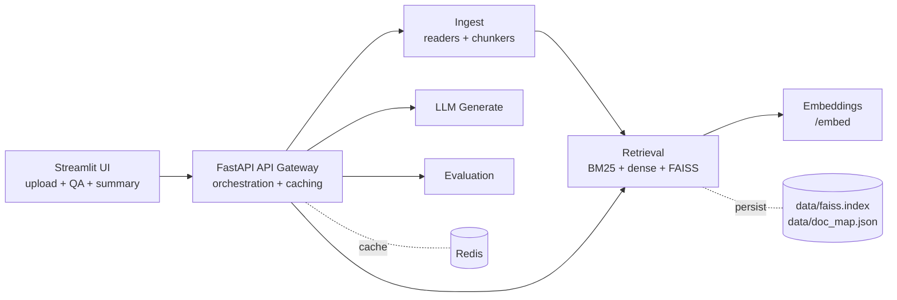

# Intelligent Content Analyzer

A document QA and summarization assistant for educational materials, surfaced through a Streamlit UI and a FastAPI gateway.

It is explicitly multilingual, with same-language answers when possible, and the embedding path has an offline deterministic fallback.

<!-- README_SURFACE_START -->
  

[](https://adredes-weslee.github.io/ai/rag/document-intelligence/2026/03/24/building-service-oriented-document-intelligence.html) [](https://adredes-weslee-intelligent-content-analyzer-uiapp-stwg9a.streamlit.app/)


```mermaid
flowchart LR
    UI["Streamlit UI<br/>upload + QA + summary"] --> GW["FastAPI API Gateway<br/>orchestration + caching"]
    GW --> ING["Ingest<br/>readers + chunkers"]
    ING --> RET["Retrieval<br/>BM25 + dense + FAISS"]
    GW --> RET
    RET --> EMB["Embeddings<br/>/embed"]
    GW --> GEN["LLM Generate"]
    GW --> EVAL["Evaluation"]
    GW -. cache .- REDIS[("Redis")]
    RET -. persist .- STORE[("data/faiss.index<br/>data/doc_map.json")]
```

## Quickstart

```bash
copy .env.example .env  # or cp .env.example .env
docker compose -f infra/docker-compose.yml up --build
streamlit run ui/app.py
```

See [Setup and Run](#setup-and-run) for the full environment and verification path.

<!-- README_SURFACE_END -->

## Why This Repository Exists

- Help students and other readers interrogate lecture notes, PDFs, and mixed-format documents without manual page-by-page searching, while preserving citations and summaries.

## Architecture at a Glance

- The main user-facing app is the Streamlit frontend in ui/app.py, which uploads files, asks questions, and summarizes the last uploaded document, with controls for reranking, judge scoring, diagnostics, and last-doc filtering.
- services/api_gateway/app/main.py orchestrates the app, exposes upload/QA/summary/debug routes, and switches between in-proc local mode and HTTP microservice mode based on upstream env vars.
- Ingestion is handled by services/ingest/app/main.py, services/ingest/app/readers.py, and services/ingest/app/chunkers.py, which parse multipart uploads, extract text from PDF/DOCX/PPTX/HTML/Markdown/CSV/images, and chunk section-aware.
- Retrieval is split across services/retrieval/app/main.py, services/retrieval/app/hybrid.py, and services/retrieval/app/rerank.py, which keep an in-memory chunk index, blend BM25 plus dense scores, optionally use FAISS, and expose status/debug endpoints.
- Generation, evaluation, config, caching, and tracing are split across `services/llm_generate/app/main.py`, `services/evaluation/app/main.py`, `shared/settings.py`, `shared/cache.py`, and the shared tracing utilities.
- infra/docker-compose.yml and render.yaml show a Redis-backed service split, with persistent disk only for retrieval.

## Repository Layout

- `.vscode/`
- `data/`
- `infra/`
- `services/`
- `shared/`
- `tests/`
- `ui/`
- `.dockerignore`
- `.env.example`
- `.gitignore`
- `pytest.ini`
- `README.md`
- `render.yaml`
- `requirements.txt`

## Setup and Run

1. Local setup docs are still partial: the repo documents Conda env creation/update from `infra/environment.yaml` and `python -m pytest -q`, but not a single end-to-end local run recipe.
2. The runnable pieces are the service Dockerfiles, which launch `uvicorn services.<svc>.app.main:app` (for example services/api_gateway/Dockerfile), plus the Streamlit entrypoint in ui/app.py, and infra/docker-compose.yml wires the service URLs and Redis together.
3. Runtime config is centralized in `.env.example`, and the frontend has a separate dependency file in ui/requirements.txt; the UI defaults to `http://localhost:8000`, and gateway CORS already covers localhost:8501 or `STREAMLIT_APP_ORIGIN`.

## Core Workflows

- Upload: the UI posts multipart files to `/upload_document`, the gateway parses or forwards to ingest, chunks are indexed in retrieval, and the index version is bumped so cached answers invalidate.
- QA: the UI sends question plus options, the gateway checks exact and semantic caches, runs retrieval, optional rerank, low-score query refinement or translation, generation, evaluation, confidence gating, and returns citations plus diagnostics.
- Summary: the UI calls `/document_summary` for the last uploaded document, the gateway fetches chunks by `doc_id`, summarizes them, and caches the result per document.
- Ops and feedback: `POST /feedback` is implemented, and `/debug/upstreams`, `/_retrieval_status`, `/status`, and `/debug/storage` expose runtime checks.

## Known Limitations

- The visible tests are mostly offline unit tests with `OFFLINE_MODE=1`, `TestClient`, and monkeypatching, so they do not prove a full HTTP or docker-compose end-to-end path.
- Several behaviors are best-effort fallbacks, including deterministic offline embeddings, heuristic evaluation, heuristic reranker fallback, optional Langfuse tracing, best-effort OCR, and Gemini-gated query refinement or translation.
- Persistence is explicit and limited, retrieval depends on `data/faiss.index` and `data/doc_map.json`, summary cache keys only by `doc_id`, and feedback is cached for 30 days rather than stored in a database.
- Mode selection is asymmetric: the gateway flips to HTTP if any upstream URL is set, but the summary router only uses HTTP when both retrieval and LLM URLs are configured.
